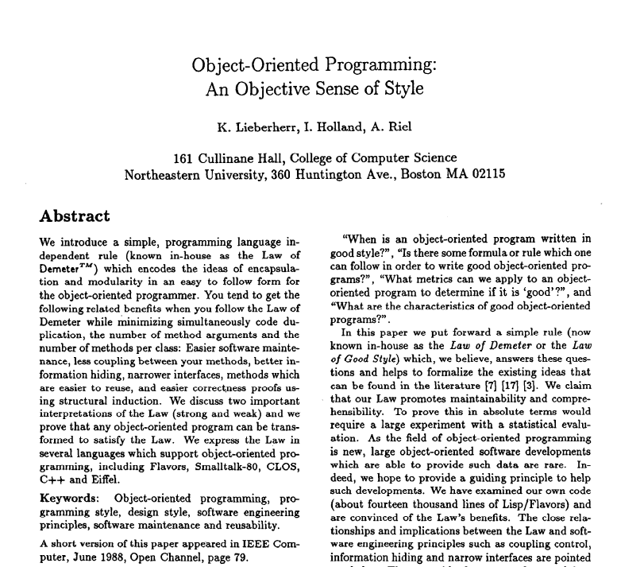

# Law of Demeter

---


^ Demeter is the Greek Goddess of the harvest. She is not the namesake for Law
of Demeter.

---



^ This paper, which was part of the Demeter project, coined the term.

---

## Law?

### Suggestion
### Heuristic

---

# What

- Design guideline
- *Not* a design pattern
- *Not* an architectural pattern

## Prescriptive > Descriptive

^ What's cool about design guidelines vs. design patterns. Prescriptive over
descriptive. Programmers get themselves into trouble by applying design
patterns to a problem too early on. But design guidelines are things to keep in
mind always as we write code.

---

# Why

- AG Models
- Solve some design issues in `ag_search` and `nhg_search`

^ Why am I studying this now? ag_search and nhg_search examples. We presented
APIs that improved things in some ways, but actually threw this problem over the
controller/view boundary. Created helpers for nested data so as not to be
structurally coupled in the view layer. But that was just a workaround for the
fact that the API invited Demeter violations.

---

```ruby
class Listing
  include Virtus.model

  attribute :id,      Integer
  attribute :website, String
  attribute :mgmt_co, ManagementCompany
end

class ManagementCompany
  include Virtus.model

  attribute :name,    String, default: ''
end

@listing = Listing.new({
  website: 'http://www.sagebrookchapelhill.com',
  mgmt_co: { name: 'Posh Properties' })

def listing_info
  "Site: #{@listing.website}, " +
  "Management company: #{@listing.mgmt_co.name}" # D'oh!
end

```

^ Here we have a simplified version of Listing and ManagementCompany. We're
using composition (yay!) to associate the two objects. But, because of the
reference we have to Listing and that object's API, we are tempted to reach
through the listing to get to the management company name.

---

## Why is this a bad idea?

```ruby
@listing.mgmt_co # => nil
@listing.mgmt_co.name # NoMethodError: undefined method `name' for nil:NilClass
```

^ Pasha gets another story

---

## The Rails Way

```ruby
def listing_info
  "Site: #{@listing.website}, " +
  "Management company: #{@listing.try(:mgmt_co).try(:name)}" # UGH
end
```

^ Rails can be an unhealthy enabler

^ Code just looks bad

---

## DRY

^ "Every piece of knowledge must have a single, unambiguous, authoritative
representation within the system." Not just consolidating duplicate code.

- Code
- Data

^ API keys example

---

## DRY and structural knowledge

What does this code snippet know?

```ruby
def listing_info
  "Site: #{@listing.website}, " +
  "Management company: #{@listing.mgmt_co.try(:name)}" # D'oh!
end
```

- `@listing` has a website
- `@listing` may or may not have a mgmt_co
- `@listing` mgmt_co has a name, or maybe not

---

## How we worked around this

^ This is not an exact code snippet

### Punt to the view layer!

```ruby
module MyHelpers
  def mgmt_co
    @listing.mgmt_co || NullMgmtCo
  end
end
```

---

## Another example

```ruby
# Mirroring the database
cc_number = person.wallet.credit_cards.first.number

# OOP
cc_number = person.credit_card_number
```

- Test has deeply nested mock object, used repeatedly
- Change in intermediary objects = Change all mocks
- Mocks suck!

---

## Rules for message sending

- Local variables
- Passed in parameters
- Instance variables
- Methods on the same class

---

## Oversimplification:

### One dot per statement

---

## Except when returning the same kind of object

```ruby
string.strip.downcase
```

See also: jQuery method chaining

---

## Delegation party?

### Use facets

^ In our domain, the listing we present on the SRP pages are quite different
than the listing we present on detail pages, or on the map view.

^ Example of patient interacting with doctor, interacting with receptionist at
checkout.

---

## Resources

- Original Law of Demeter paper: http://bit.ly/demeter-paper
- Avdi Grimm blog post:
  http://devblog.avdi.org/2011/07/05/demeter-its-not-just-a-good-idea-its-the-law/
- Understanding the 4 Rules of Simple Design:
  https://leanpub.com/4rulesofsimpledesign

